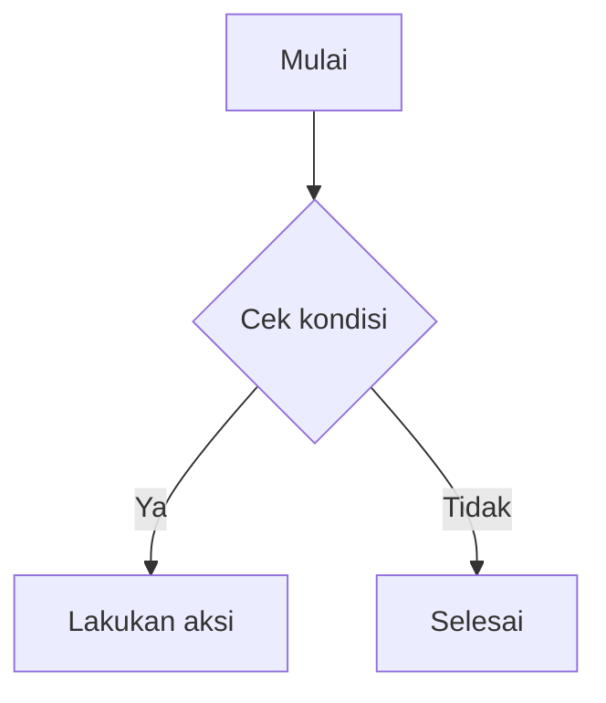

# Cara Pakai Markdown di Wolio Word

Panduan singkat sintaks Markdown yang didukung editor Wolio Word, lengkap dengan contoh. Tulis di panel **Editor**, lihat hasilnya langsung di panel **Review**.

## Heading

```
# Judul 1
## Judul 2
### Judul 3
```

Heading otomatis muncul di panel **Daftar Isi** (ikon garis di activity bar).

## Teks

| Sintaks | Hasil |
|---|---|
| `**tebal**` | **tebal** |
| `*miring*` | *miring* |
| `***tebal miring***` | ***tebal miring*** |
| `~~coret~~` | ~~coret~~ |
| `` `kode inline` `` | `kode inline` |
| `<kbd>Ctrl</kbd>` | tombol keyboard bergaya |

## List

```
- Item satu
- Item dua
  - Sub-item

1. Langkah pertama
2. Langkah kedua

- [ ] Belum selesai
- [x] Sudah selesai
```

## Blockquote

```
> Ini kutipan.
> Bisa nested juga:
> > Kutipan di dalam kutipan.
```

## Kode blok (dengan syntax highlight + tombol salin)

````
```js
function halo(nama) {
  console.log("Halo, " + nama);
}
```
````

Ganti `js` dengan bahasa lain (`python`, `html`, `css`, dll) untuk highlight yang sesuai.

## Tabel

```
| Nama | Peran |
|---|---|
| Randy | Developer |
| Wolio Word | Editor |
```

## Link & Gambar

```
[Teks tautan](https://contoh.com "judul opsional")

```

Link eksternal (`http/https`) otomatis dibuka di tab baru.

## Garis pemisah

```
---
```

## Diagram Mermaid

````

````

> Butuh koneksi internet **sekali** saat pertama kali dipakai (memuat library Mermaid dari CDN). Setelah itu bisa dipakai offline selama sesi browser masih terbuka. Kalau tidak ada internet sama sekali, kode diagramnya tetap ditampilkan sebagai teks biasa (fallback), tidak error.

## Fitur editor pendukung

- **Mode Editor / Review / Split** — tombol di kanan atas header.
- **Command Palette** (`Ctrl+K`) — jalankan aksi cepat lewat pencarian.
- **Cari & Ganti** (`Ctrl+F`) — ikon kaca pembesar di activity bar.
- **Tab & multi-file** — buka beberapa dokumen sekaligus, tersimpan otomatis di browser (localStorage) — tidak hilang saat direfresh.
- **Riwayat versi (checkpoint)** — simpan snapshot manual dari tab yang aktif lewat panel Files.
- **Impor / Ekspor** — impor `.md` / `.txt`, ekspor sebagai `.md`, `.txt`, `.html` (mandiri, bisa dibuka standalone), atau `.pdf` (lewat dialog cetak browser).

## Catatan

Wolio Word 100% berjalan offline di browser — tidak butuh server, tidak butuh instalasi. Cukup buka `index.html`.
